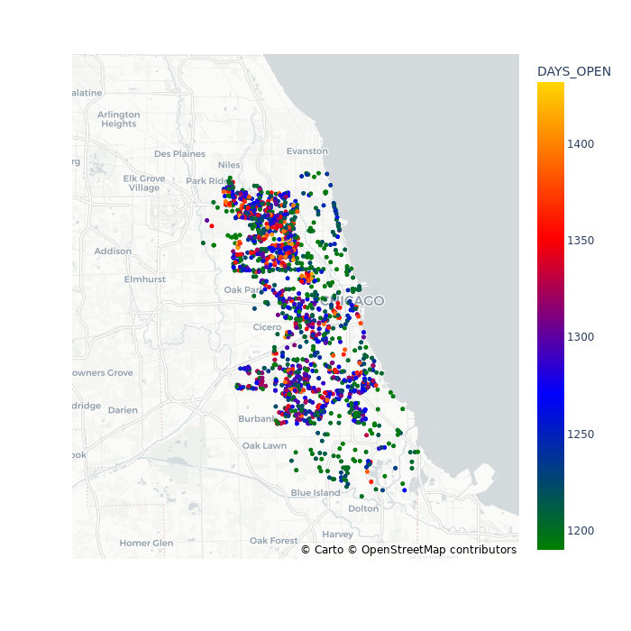
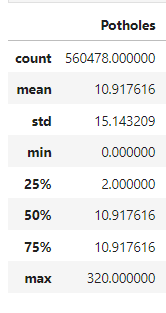
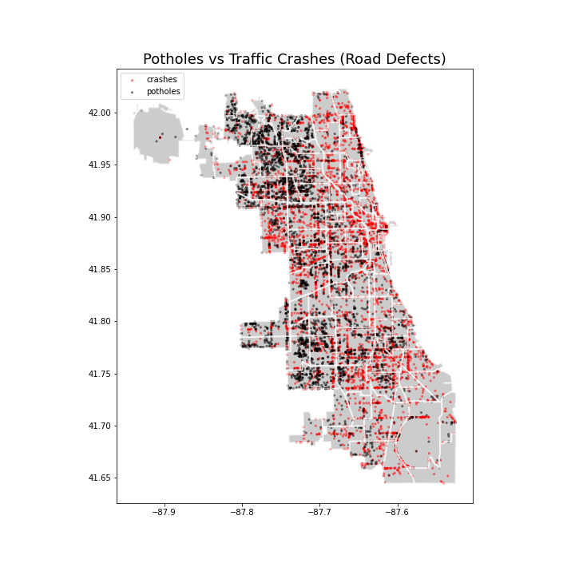
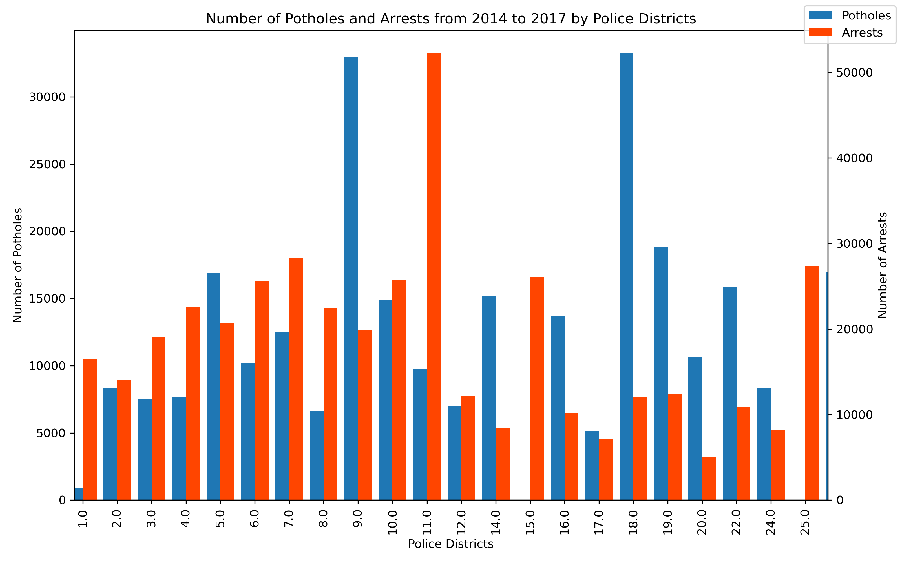

# Chicago Potholes Data (2011 - 2018)
Introduction

## Data Collection
For this analysis, the main source of data contains potholes reported through 3-1-1 service requests in the city of Chicago, IL from 2010 through 2018. The data was made available by the City of Chicago, along with data on traffic crashes reported through the electronic crash reporting system under the jurisdiction of the Chicago Police Department. Additionally, income data by neighborhood was sourced from the U.S. Census Bureau to analyze the correlation between pothole repairs and surrounding household residential income, and arrest data from the Chicago Police Department was used to investigate geographic relationships between density of potholes and surrounding area criminal activity.

**Data Dictionaries:**
- [Potholes](data/potholes_data_dictionary.csv)
- [Traffic Crashes](data/crash_data_dictionary.csv)
- [Census](data/census_data_dictionary.csv )
- [Arrest](data/arrest_data_dictionary.csv)

## Analysis: Pothole Status by Neighborhood
To visualize pothole service request status geographically, a map was created plotting open versus completed pothole requests in the Chicago area. A basemap of Chicago neighborhoods was used to analyze any correlation and provide visual context to the income analysis explore below. As seen on the map, there do appear to be neighborhoods with a higher ratio of open to closed pothole service requests, although more rigorous analysis is needed to determine an exact relationship. For example, a neighborhood may appear to have a higher concentration of open requests, however, due to the sheer volume of completed requests over the time frame, it is difficult to visually determine the true ratio.

Looking at just the open potholes, I subtracted todays date from `Creation Date` to create the column `Days_Open` to see which areas of Chicago had the longest ongoing unserviced potholes. The code for this part can be found [here](code/open_potholes_map.ipynb). Interestingly, the average time of these service requests have been open are much longer than the average completion time for the closed requests, and the longest unserviced areas are concentrated in the northwest Chicago area.
 

## Analysis: Completion Time and Per Capita Income
The code for this part of the analysis can be found [here](code/census-pot.ipynb).
The idea was an exploration of the relationship between pothole completion times and income in Chicago's 77 community zones. First, the `Completion Time` variable was created by subtracting `Creation Date` from `Completion Date`. Then the `potholes` dataset was grouped by `Community Area`, where we calculated the total counts of potholes and the mean completion time of potholes by community area. This data frame was then merged with the `census_data` data frame into a final form `working_data`, which has each community area and community area name along with their per capita incomes, total counts of potholes over the years, and average completion time.

In the following two plots, the per capita income of the neighborhoods with the top 5 longest completion times and top 5 shortest completion times are shown. These metrics were calculated by viewing `working_data.head() ` and `working_data.tail()`. It seems that the incomes of neighborhoods with longer completion times are higher, but this analysis does not include other confounding variables, such as the population of each community area.

To further this analysis, a scatterplot was created with `Per Capita Income` on the x-axis and `Completion Time` on the y-axis: 
In the scatterplot, the color scale is by number of potholes, with the darkest points having the fewest number of potholes and the lighest points having the most potholes in that community zone. We see that in areas with the lowest incomes, even having a smaller number of potholes than in richer areas results in a slower average completion time.

## Analysis: Potholes vs. Income for the Chicago Area
To see the code for this part of the analysis, please refer to the following [link](Data_Cleaning/pothole_data/Pothole_data.ipynb). This uses `Pothole Data` from the Chicago area.
I perform some simple data cleaning commands for the Potholes dataset by changing messy names of columns, sorting some of the variables by first name, and dropping duplicate values. I also replace missing values for the numerical columns with either the mean, mode, the zero value, or a pre-specified value. I check to make sure that none of the columns have any null entries in them. The I go ahead and perform some simple statistics for the pothole data to show the mean, standard deviation, min, max and the 25%, 50% and 75% quantiles for each variable in the dataset. I create a correlation table among variables in the dataset. Lastly, I create a scatterplot that shows the Number of Potholes in Block by Creation Date.  

I also look at the `Income Data` in the Chicago area by first merging it with the `Pothole Data`. I perform a simple regression between the `The Number of Potholes in Block` as the dependent variable and the `Per Capita Income` and `Hardship Index` as the independent variables. The result is the following
In this table we see that a one unit increase in per capita income leads to a decrease of approximately 2.9 units in the number of potholes in the block, a coefficient which is statistically significant. Similarly, we see that a one unit increase in the hardship index leads to a decrease of approximately 0.001 in the number of potholes in the block, a coefficient which is nonetheless not statistically significant.

.

## Analysis: Potholes vs. Traffic Crashes
In this analysis, we attempt to visualize the density of potholes and traffic crashes due to road defects. The traffic crash data was obtained from the City of Chicago and the Chicago Police Department and was filtered to only include crashes during the 2010 - 2018 timeframe that were caused by rut or hole road defects. These were then plotted alongside potholes (both open and completed) over the neighborhood map. From the plot below, we can see that certain neighborhoods, particularly in the Northwest and Southwest regions, have a high percentage of both potholes and traffic crashes, ostensibly a significant portion of which were directly caused by potholes. Further rigorous analysis including linkage of crashes to potholes through latitude and longitude and time stamps would provide a clearer methodology to investigate how potholes affect public health across neighborhoods.  

## Analysis: Potholes vs. Arrests in the Chicago Area
The code used for the analysis can be found [here](code/arrestdata.ipynb).
The motivation was that for each police district, there might be more intense activities where the arrests happen more which might lead to increased numbers of potholes. As the arrest data was available for 2014-2017, I focused on the years of 2014-2017 in the potholes data. I grouped the data and counted all the arrests and created potholes in those years and plotted them by police districts.

Unfortunately, it does not seem they are closely correlated.

## Analysis: OLS Regression
To better understand the relation between our pothole data and other social factors, a regression analysis was used. Data wrangling on our main data set, census data, and crime statistics allowed to produce the necessary variables. The dependent variable in the first regression was total pothole density (count/km^2), and for the second it was average pothole service request completion time; both separated by community area. The regressors were average income, percentage of people below the poverty line, yearly crime expected rate, and population density (people/km^2); all by community area.
The results for the first regression clearly indicate significant effects for crime rate, population density, and population below the poverty line. The latter, notably, is negative; this is possibly due to car ownership among empoverished people. The R-squared is fairly high at around 0.69 .

The results for the second regression indicate only a significant effect for population density, and a fairly low R-squared of about 0.16, indicating that contrarily to our intuition, the factors chose were not very relevant predictors of pothole servicing time.

## Conclusion

